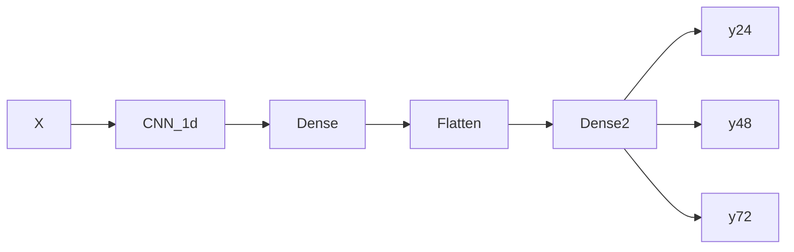

# Aguathon 2019


| Autor  | Maximiliano Greco            |
| :---:  | :---------------:            |
| Mail   | mmngreco@gmail.com           |
| Github | https://github.com/mmngreco/ |


## Instalación

```
conda env create -f environment.yml
```

## Uso

```
conda activate river
```

Para la prediccón se ha usado una red neuroal.
Concretamente he empleado la api de `keras`.

### Estructura de la RED



A partir del dataset con los datos originales, he construido `X` para poder
aprovechar el poder de las CNN. Esto es:

Si el dataset se compone de $\{x_0, ...,x_n\}$ para cada registro del nivel del rio:

| X         |       |         |
| :---:     | :---: | :---:   |
| $x_0$     | ...   | $x_0+k$ |
| $x_1$     | ...   | $x_1+k$ |
| ...       | ...   | ...     |
| $x_n-k-m$ | ...   | $x_n-m$ |

| Y         |
| :--:      |
| $x_{1+k}$ |
| ...       |
| $x_{n}$   |

### Dónde:

- `k` : Número de observaciones temporales que incluimos en cada fila, cantidad de información pasada (look back).
- `m` : Número de observaciones futuras que se van a predicir (look ahead)
- `n` : Total de elementos.

En este caso `m` se compone de {24, 48, 72}

El uso de la red CNN esta motivado principalemente por el hecho de que es capaz de encontrar patrones mas.
