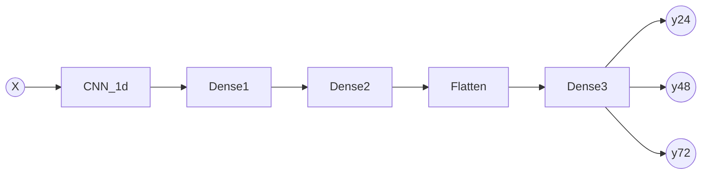

# Aguathon 2019


| Autor  | Maximiliano Greco            |
| :---:  | :---------------:            |
| Mail   | mmngreco@gmail.com           |
| Github | https://github.com/mmngreco/ |


## Instalación

Definimos un entorno virtual con conda.

```bash
conda env create -f environment.yml
```

## Uso

```bash
conda activate river
python CNN2d_feat.py -h  # para entrenar
python predict.py -h  # para predecir
```

## Motivación

Para la prediccón se ha usado una red neuronal que mezcla una capa
"convolucional", seguida de una capa oculta  y una capa "full conected" de
salida. Esta arquitectura es la que mejor me ha funcionado, otros proyectos que
he visto, usan LSTM o GRU, sin embargo, esa aproximación no me ha dado buenos
resultados con el añadido de que poco intuitivas y dificiles de entender.

### Estructura de la RED



En el script `CNN_feat.py` se encuentra la función `build_model()` que se encarga
de crear la red de acuerdo a unos parámetros. Pero en esencia es lo siguiente:

```python
model = Sequential()
model.add(Conv1D(
    filters=filters,
    kernel_size=kernel_size,
    activation='relu',
    input_shape=(n_steps, n_features),
))
model.add(Dense(
    NEURONS1,
    activation='relu',
    kernel_regularizer=L1L2,
))
model.add(Dense(
    n_features,
    activation='relu',
    kernel_regularizer=L1L2,
))
model.add(Flatten())
model.add(Dense(NEURONS_OUT))
model.compile(optimizer='adam', loss='mse')
model.summary()
```

## Los datos

Para aprovechar esta arquitectura e incluir información pasada de cada feature,
he creado una función que se encarga de formatear los datos para la
arquitectura anterior. A partir del dataset con los datos originales, se ha
construido `X` de la siguiente forma:

Si el dataset contiene una sequencia temporal por cada rio que se compone de
$\{x^i_0, ...,x^i_n\}$, donde i cada uno de los ríos:

La matriz de entrenamiento tiene la siguiente forma:

| $X^i_{m,k}$ = |                 |       |             |
| :---:         | :---:           | :---: | :---:       |
| $x^i_0$       | $x^i_{0+1}$     | ...   | $x^i_{0+k}$ |
| $x^i_1$       | $x^i_{1+1}$     | ...   | $x^i_{1+k}$ |
| ...           | ...             | ...   | ...         |
| $x^i_{n-k-m}$ | $x^i_{n+1-k-m}$ | ...   | $x^i_{n-m}$ |

El output:

| $Y^{i=5}_{m,k}$ = |
| :--:          |
| $x^{i=5}_{1+k}$   |
| $x^{i=5}_{2+k}$   |
| ...           |
| $x^{i=5}_{n}$     |

### Dónde:

- `k` : Número de observaciones temporales que incluimos en cada fila. Puede ver como la cantidad de información pasada que contiene cada observación (look back).
- `m` : Distancia de la observacion futuras que se va a predicir (look ahead). En este caso $m  = \{24, 48, 72\}$
- `n` : Número total de elementos.
- `i` : Es cada río, y por tanto i=5 corresponde a Zaragoza.

La dimensión de X es (N,6,1), y la de y es (N, 1).


