# Aguathon 2019


| Autor  | Maximiliano Greco            |
| :---:  | :---------------:            |
| Github | https://github.com/mmngreco/ |


## 1. Instalación

### Conda

Definir un entorno virtual con conda.

```bash
conda env create -f environment.yml -n river
conda activate river
```

### Docker

```bash
docker build -t aguathon .
docker run -it aguathon
```

## 2. Uso

Para entrenar modelos:

```python
python CNN_feat2d.py -h  # para entrenar (no es necesario)
```

Para predecir con los modelos entrenados, solo hay que ejecutar:

```python
python predict.py  # para predecir
```


## 3. Motivación

Para la prediccón se ha usado una red neuronal que mezcla una capa
"convolucional", seguida de una capa oculta  y una capa "full conected" de
salida. Esta arquitectura es la que mejor me ha funcionado, otros proyectos que
he visto, usan LSTM o GRU, sin embargo, esa aproximación no me ha dado buenos
resultados con el añadido de que poco intuitivas y dificiles de entender.

Esta estructura la he definido a partir de la intuición y del ensayo error.
La mayoria de trabajos y proyectos que he consulado no hacían uso de las redes
recurrentes, en su lugar aplicaban redes neuronals o bien LSTM. Me pareció que
merecía la pena hacer la prueba ya que estas redes se aplican en imagen
fundamentalmente. En nuestro caso, a pesar de tener series temporales, parece
que funcionan especialmente bien debido a la similitud dimensional con las
imagenes, en cierta, forma estos río forman una "imagen" que queremos predecir.


### Estructura de la RED

Puede ver este diagrama usando un renderizador de [`mermaid`](https://mermaidjs.github.io/mermaid-live-editor/#/view/eyJjb2RlIjoiZ3JhcGggTFJcblhfMjQoKFgpKSAtLT4gQ05OXzFkXzI0XG55MjQoKHkyNCkpIC0tPiBDTk5fMWRfMjRcbkNOTl8xZF8yNCAtLT4gRGVuc2UxXzI0XG5EZW5zZTFfMjQgLS0-IERlbnNlMl8yNFxuRGVuc2UyXzI0IC0tPiBGbGF0dGVuXzI0XG5GbGF0dGVuXzI0IC0tPiBEZW5zZTNfMjRcbkRlbnNlM18yNCAtLT4geWhhdF8yNCgoeWhhdDI0KSlcblxuXG5YXzQ4KChYKSkgLS0-IENOTl8xZF80OFxueV80OCgoeTQ4KSkgLS0-IENOTl8xZF80OFxuQ05OXzFkXzQ4IC0tPiBEZW5zZTFfNDhcbkRlbnNlMV80OCAtLT4gRGVuc2UyXzQ4XG5EZW5zZTJfNDggLS0-IEZsYXR0ZW5fNDhcbkZsYXR0ZW5fNDggLS0-IERlbnNlM180OFxuRGVuc2UzXzQ4IC0tPiBCXzQ4KCh5aGF0NDgpKVxuXG5YXzcyKChYKSkgLS0-IENOTl8xZF83MlxueV83MigoeTcyKSkgLS0-IENOTl8xZF83MlxuQ05OXzFkXzcyIC0tPiBEZW5zZTFfNzJcbkRlbnNlMV83MiAtLT4gRGVuc2UyXzcyXG5EZW5zZTJfNzIgLS0-IEZsYXR0ZW5fNzJcbkZsYXR0ZW5fNzIgLS0-IERlbnNlM183MlxuRGVuc2UzXzcyIC0tPiBCXzcyKCh5aGF0NzIpKSIsIm1lcm1haWQiOnsidGhlbWUiOiJkZWZhdWx0In19).



En el script `CNN_feat2d.py` se encuentra la función `build_model()` que se encarga
de crear la red de acuerdo a unos parámetros. Pero en esencia es lo siguiente:

```python
model = Sequential()
model.add(Conv1D(
    filters=filters,
    kernel_size=kernel_size,
    activation='relu',
    input_shape=(n_steps, n_features),
))
model.add(Dense(
    NEURONS1,
    activation='relu',
    kernel_regularizer=L1L2,
))
model.add(Dense(
    n_features,
    activation='relu',
    kernel_regularizer=L1L2,
))
model.add(Flatten())
model.add(Dense(NEURONS_OUT))
model.compile(optimizer='adam', loss='mse')
```


