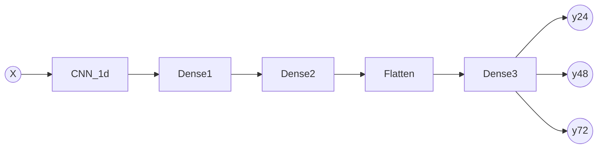

# Aguathon 2019


| Autor  | Maximiliano Greco            |
| :---:  | :---------------:            |
| Mail   | mmngreco@gmail.com           |
| Github | https://github.com/mmngreco/ |


## Instalación

Definir un entorno virtual con conda.

```bash
conda env create -f environment.yml
```

## Uso

```bash
conda activate river
python CNN_feat2d.py -h  # para entrenar
python predict.py -h  # para predecir
```

## Motivación

Para la prediccón se ha usado una red neuronal que mezcla una capa
"convolucional", seguida de una capa oculta  y una capa "full conected" de
salida. Esta arquitectura es la que mejor me ha funcionado, otros proyectos que
he visto, usan LSTM o GRU, sin embargo, esa aproximación no me ha dado buenos
resultados con el añadido de que poco intuitivas y dificiles de entender.

Esta estructura la he definido a partir de la intuición y del ensayo error.
La mayoria de trabajos y proyectos que he consulado no hacían uso de las redes
recurrentes, en su lugar aplicaban redes neuronals o bien LSTM. Me pareció que
merecía la pena hacer la prueba ya que estas redes se aplican en imagen
fundamentalmente. En nuestro caso, a pesar de tener series temporales, parece
que funcionan especialmente bien debido a la similitud dimensional con las
imagenes, en cierta, forma estos río forman una "imagen" que queremos predecir.


### Estructura de la RED

Puede ver este diagrama usando un renderizador de [`mermaid`](https://mermaidjs.github.io/mermaid-live-editor/#/view/eyJjb2RlIjoiZ3JhcGggTFJcbkEoKFgpKSAtLT4gQ05OXzFkXG5DTk5fMWQgLS0-IERlbnNlMVxuRGVuc2UxIC0tPiBEZW5zZTJcbkRlbnNlMiAtLT4gRmxhdHRlblxuRmxhdHRlbiAtLT4gRGVuc2UzXG5EZW5zZTMgLS0-IEIoKHkyNCkpXG5EZW5zZTMgLS0-IEMoKHk0OCkpXG5EZW5zZTMgLS0-IEQoKHk3MikpXG4iLCJtZXJtYWlkIjp7InRoZW1lIjoiZGVmYXVsdCJ9fQ).




En el script `CNN_feat.py` se encuentra la función `build_model()` que se encarga
de crear la red de acuerdo a unos parámetros. Pero en esencia es lo siguiente:

```python
model = Sequential()
model.add(Conv1D(
    filters=filters,
    kernel_size=kernel_size,
    activation='relu',
    input_shape=(n_steps, n_features),
))
model.add(Dense(
    NEURONS1,
    activation='relu',
    kernel_regularizer=L1L2,
))
model.add(Dense(
    n_features,
    activation='relu',
    kernel_regularizer=L1L2,
))
model.add(Flatten())
model.add(Dense(NEURONS_OUT))
model.compile(optimizer='adam', loss='mse')
```


